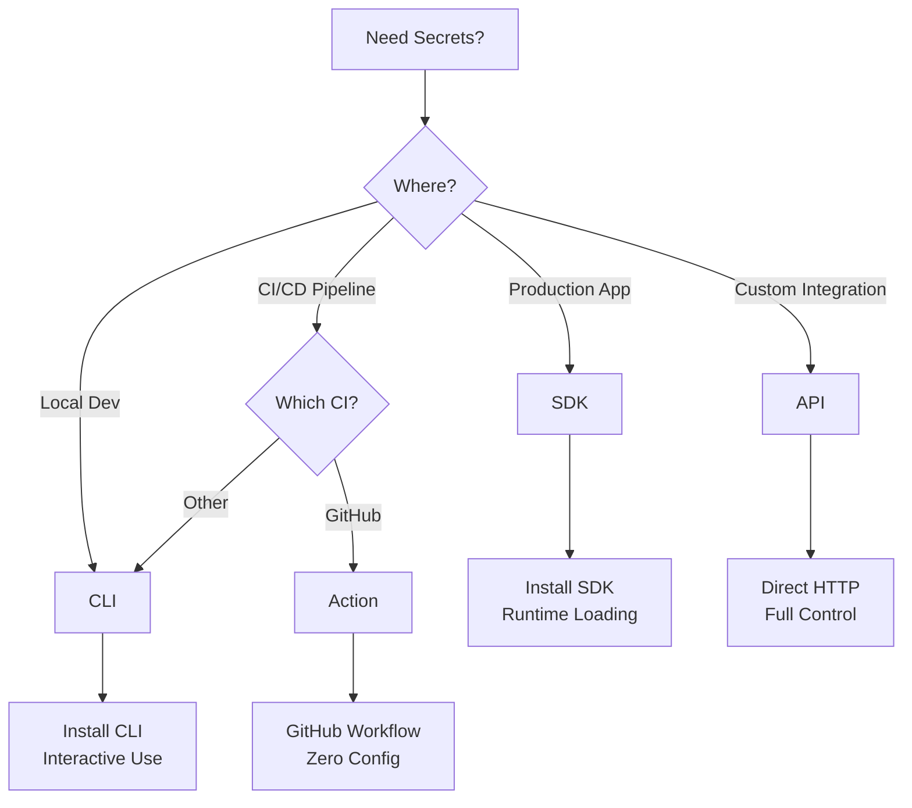

# API vs CLI vs SDKs

DotEnv provides multiple interfaces for managing secrets. This guide helps you choose the right tool for your use case and understand how they work together.

## Overview Comparison

| Feature            | CLI                 | API                 | SDKs                | GitHub Action   |
| ------------------ | ------------------- | ------------------- | ------------------- | --------------- |
| **Best For**       | Development, DevOps | Custom integrations | Application runtime | CI/CD pipelines |
| **Authentication** | OAuth/API Key       | API Key             | API Key             | API Key         |
| **Installation**   | Required            | None                | Language-specific   | Built-in        |
| **Interactive**    | Yes                 | No                  | No                  | No              |
| **Scriptable**     | Yes                 | Yes                 | Yes                 | Yes             |
| **Real-time**      | No                  | Yes                 | Yes                 | No              |

## CLI (Command Line Interface)

### When to Use

The CLI is ideal for:

- Local development workflow
- DevOps automation scripts
- Interactive secret management
- Quick administrative tasks
- Initial project setup

### Key Features

```bash
# Interactive login
dotenv login

# Project management
dotenv projects create my-app
dotenv projects list

# Secret management
dotenv secrets set DATABASE_URL="..." --project my-app
dotenv secrets list --project my-app
dotenv secrets pull --project my-app > .env

# Run with secrets
dotenv run --project my-app -- npm start
```

### Advantages

✅ **Human-friendly**: Interactive prompts and helpful output
✅ **Cross-platform**: Works on Windows, macOS, Linux
✅ **No code required**: Use immediately without programming
✅ **Powerful scripting**: Combine with shell scripts
✅ **Offline capabilities**: Some commands work offline

### Limitations

❌ **Installation required**: Must install CLI tool
❌ **Not for production**: Better suited for development
❌ **Batch operations**: Less efficient for bulk operations
❌ **Polling required**: No real-time updates

### CLI Workflows

#### Development Workflow

```bash
# Morning setup
dotenv login
dotenv projects use my-app
dotenv secrets pull > .env
npm run dev

# Adding new secret
dotenv secrets set NEW_API_KEY="..." --interactive
dotenv secrets pull > .env
npm restart
```

#### CI/CD Workflow

```bash
#!/bin/bash
# deploy.sh

# Authenticate
export DOTENV_API_KEY=$CI_DOTENV_KEY

# Pull secrets
dotenv secrets pull \
  --project my-app \
  --environment production \
  > .env

# Deploy
source .env
./deploy-app.sh
```

## API (REST API)

### When to Use

The API is ideal for:

- Custom integrations
- Programmatic access
- Building tools
- Enterprise systems
- Real-time synchronization

### Key Features

```bash
# Base URL
https://api.dotenv.cloud/v1

# Authentication
Authorization: Bearer YOUR_API_KEY

# Get secrets
GET /projects/{project}/secrets
GET /projects/{project}/environments/{environment}/secrets

# Set secret
PUT /projects/{project}/secrets/{key}
{
  "value": "encrypted_value",
  "environment": "production"
}
```

### Advantages

✅ **Language agnostic**: Use from any programming language
✅ **Full control**: Access all DotEnv features
✅ **Real-time**: Webhooks for instant updates
✅ **Scalable**: Handle thousands of requests
✅ **Direct integration**: No intermediary tools

### Limitations

❌ **More complex**: Requires programming knowledge
❌ **Authentication**: Must manage API keys
❌ **Rate limits**: Subject to API rate limiting
❌ **No helpers**: Must implement encryption/decryption

### API Examples

#### Python Integration

```python
import requests

class DotEnvAPI:
    def __init__(self, api_key):
        self.api_key = api_key
        self.base_url = "https://api.dotenv.cloud/v1"
        self.headers = {
            "Authorization": f"Bearer {api_key}",
            "Content-Type": "application/json"
        }

    def get_secrets(self, project, environment="development"):
        response = requests.get(
            f"{self.base_url}/projects/{project}/environments/{environment}/secrets",
            headers=self.headers
        )
        return response.json()

    def set_secret(self, project, key, value, environment="development"):
        response = requests.put(
            f"{self.base_url}/projects/{project}/secrets/{key}",
            headers=self.headers,
            json={
                "value": value,
                "environment": environment
            }
        )
        return response.json()
```

#### Webhook Integration

```javascript
// Express webhook handler
app.post("/webhooks/dotenv", (req, res) => {
    const { event, data } = req.body;

    switch (event) {
        case "secret.updated":
            console.log(`Secret ${data.key} updated in ${data.environment}`);
            reloadApplication();
            break;

        case "secret.deleted":
            console.log(`Secret ${data.key} removed`);
            handleMissingSecret(data.key);
            break;
    }

    res.sendStatus(200);
});
```

## SDKs (Software Development Kits)

### When to Use

SDKs are ideal for:

- Application runtime
- Automatic secret loading
- Language-specific integrations
- Type safety
- Simplified implementation

### Available SDKs

#### JavaScript/TypeScript

```javascript
import { DotEnv } from "@dotenv/sdk";

const dotenv = new DotEnv({
    apiKey: process.env.DOTENV_API_KEY,
    project: "my-app",
    environment: process.env.NODE_ENV,
});

// Load all secrets
await dotenv.load();

// Access secrets
console.log(process.env.DATABASE_URL);

// Load specific keys
await dotenv.load({
    keys: ["DATABASE_URL", "API_KEY"],
});
```

#### Python

```python
from dotenv_sdk import DotEnv

dotenv = DotEnv(
    api_key=os.getenv('DOTENV_API_KEY'),
    project='my-app',
    environment=os.getenv('ENV', 'development')
)

# Load secrets
dotenv.load()

# Use secrets
database_url = os.getenv('DATABASE_URL')
```

#### Go

```go
package main

import (
    "github.com/dotenv/sdk-go"
)

func main() {
    client := dotenv.New(dotenv.Config{
        APIKey:      os.Getenv("DOTENV_API_KEY"),
        Project:     "my-app",
        Environment: os.Getenv("GO_ENV"),
    })

    // Load secrets
    err := client.Load()
    if err != nil {
        log.Fatal(err)
    }

    // Access secrets
    dbURL := os.Getenv("DATABASE_URL")
}
```

### Advantages

✅ **Language-native**: Idiomatic for each language
✅ **Type safety**: TypeScript/Go interfaces
✅ **Automatic loading**: Simple initialization
✅ **Error handling**: Built-in retry logic
✅ **Caching**: Intelligent secret caching

### Limitations

❌ **Language-specific**: Need different SDK per language
❌ **Runtime dependency**: Adds to application dependencies
❌ **Version management**: Must keep SDK updated
❌ **Network required**: Needs API access at runtime

### SDK Features

#### Automatic Retry

```javascript
const dotenv = new DotEnv({
    apiKey: "your-key",
    project: "my-app",
    retry: {
        attempts: 3,
        delay: 1000,
        backoff: "exponential",
    },
});
```

#### Caching

```python
dotenv = DotEnv(
    api_key='your-key',
    project='my-app',
    cache_ttl=300,  # 5 minutes
    cache_backend='redis'
)
```

#### Fallback Values

```go
client := dotenv.New(dotenv.Config{
    APIKey:  os.Getenv("DOTENV_API_KEY"),
    Project: "my-app",
    Fallback: map[string]string{
        "API_URL": "http://localhost:3000",
        "LOG_LEVEL": "info",
    },
})
```

## GitHub Action

### When to Use

The GitHub Action is ideal for:

- GitHub-hosted CI/CD
- Pull request checks
- Automated deployments
- Scheduled tasks
- GitHub-integrated workflows

### Features

```yaml
name: Deploy
on: [push]

jobs:
    deploy:
        runs-on: ubuntu-latest
        steps:
            - uses: actions/checkout@v3

            - name: Load secrets from DotEnv
              uses: dotenv/actions@v1
              with:
                  api-key: ${{ secrets.DOTENV_API_KEY }}
                  project: my-app
                  environment: ${{ github.ref == 'refs/heads/main' && 'production' || 'staging' }}

            - name: Build and Deploy
              run: |
                  # Secrets are now in environment
                  echo "Database: $DATABASE_URL"
                  npm run build
                  npm run deploy
```

### Advantages

✅ **Native integration**: Works seamlessly with GitHub
✅ **No installation**: Pre-built action
✅ **Matrix builds**: Different secrets per job
✅ **Conditional loading**: Based on branch/tag
✅ **Secure**: Secrets never exposed in logs

### Limitations

❌ **GitHub only**: Doesn't work with other CI/CD
❌ **Action overhead**: Adds time to workflow
❌ **Limited features**: Subset of CLI functionality
❌ **No interactive**: Batch operations only

## Choosing the Right Tool

### Decision Matrix



### Use Case Examples

#### Scenario 1: Local Development

**Best Tool**: CLI

```bash
# Perfect for developers
dotenv run --project my-app -- npm start
```

#### Scenario 2: Production Node.js App

**Best Tool**: JavaScript SDK

```javascript
// Automatic loading at startup
await dotenv.load();
app.listen(process.env.PORT);
```

#### Scenario 3: Multi-Language Microservices

**Best Tool**: API

```python
# Consistent across all services
secrets = fetch_from_dotenv_api()
```

#### Scenario 4: GitHub Deployment

**Best Tool**: GitHub Action

```yaml
- uses: dotenv/actions@v1
  with:
      api-key: ${{ secrets.DOTENV_API_KEY }}
```

## Integration Patterns

### Hybrid Approach

Many teams use multiple tools:

```yaml
# Development: CLI
developer_workflow:
    - tool: CLI
    - purpose: Local development
    - command: dotenv run -- npm start

# CI/CD: GitHub Action + CLI
ci_workflow:
    - tool: GitHub Action
    - purpose: Load secrets
    - fallback: CLI for complex operations

# Production: SDK
production_workflow:
    - tool: SDK
    - purpose: Runtime secret loading
    - fallback: API for dynamic updates
```

### Migration Path

Starting simple and growing:

1. **Start**: CLI for development
2. **Add CI/CD**: GitHub Action or CLI in pipelines
3. **Production**: SDK for runtime
4. **Scale**: API for custom needs

### Tool Combination

```javascript
// Use SDK with API fallback
class SecretManager {
    constructor() {
        this.sdk = new DotEnv({ project: "my-app" });
        this.api = new DotEnvAPI({ apiKey: process.env.API_KEY });
    }

    async loadSecrets() {
        try {
            // Primary: Use SDK
            await this.sdk.load();
        } catch (error) {
            // Fallback: Direct API
            const secrets = await this.api.getSecrets();
            this.applySecrets(secrets);
        }
    }
}
```

## Performance Considerations

### Response Times

| Method | Cold Start | Cached | Notes             |
| ------ | ---------- | ------ | ----------------- |
| CLI    | 100-200ms  | N/A    | Process overhead  |
| API    | 50-150ms   | < 5ms  | Network latency   |
| SDK    | 100-300ms  | < 1ms  | Initial load only |
| Action | 2-5s       | N/A    | Action startup    |

### Optimization Strategies

#### CLI Optimization

```bash
# Parallel operations
dotenv secrets set KEY1=value1 KEY2=value2 KEY3=value3

# Batch pull
dotenv secrets pull --format=json | jq -r 'to_entries|map("\(.key)=\(.value)")|.[]'
```

#### SDK Optimization

```javascript
// Preload critical secrets
const dotenv = new DotEnv({
    preload: ["DATABASE_URL", "REDIS_URL"],
    lazy: true, // Load others on demand
});
```

#### API Optimization

```python
# Connection pooling
session = requests.Session()
session.headers.update({'Authorization': f'Bearer {api_key}'})

# Batch requests
secrets = session.get(f'/projects/{project}/secrets/batch?keys={",".join(keys)}')
```

## Security Comparison

| Tool   | Authentication  | Encryption    | Network Security     |
| ------ | --------------- | ------------- | -------------------- |
| CLI    | OAuth + API Key | TLS + E2E     | HTTPS only           |
| API    | API Key         | TLS           | HTTPS + Cert pinning |
| SDK    | API Key         | TLS + Caching | HTTPS + Retry        |
| Action | GitHub Secret   | TLS           | GitHub secured       |

## Next Steps

- [CLI Reference](/documentation/v1/cli/commands) - All CLI commands
- [API Reference](/documentation/v1/api/endpoints) - Complete API docs
- [SDK Guides](/documentation/v1/sdks/overview) - Language-specific guides
- [GitHub Action](/documentation/v1/integrations/github) - Action documentation
